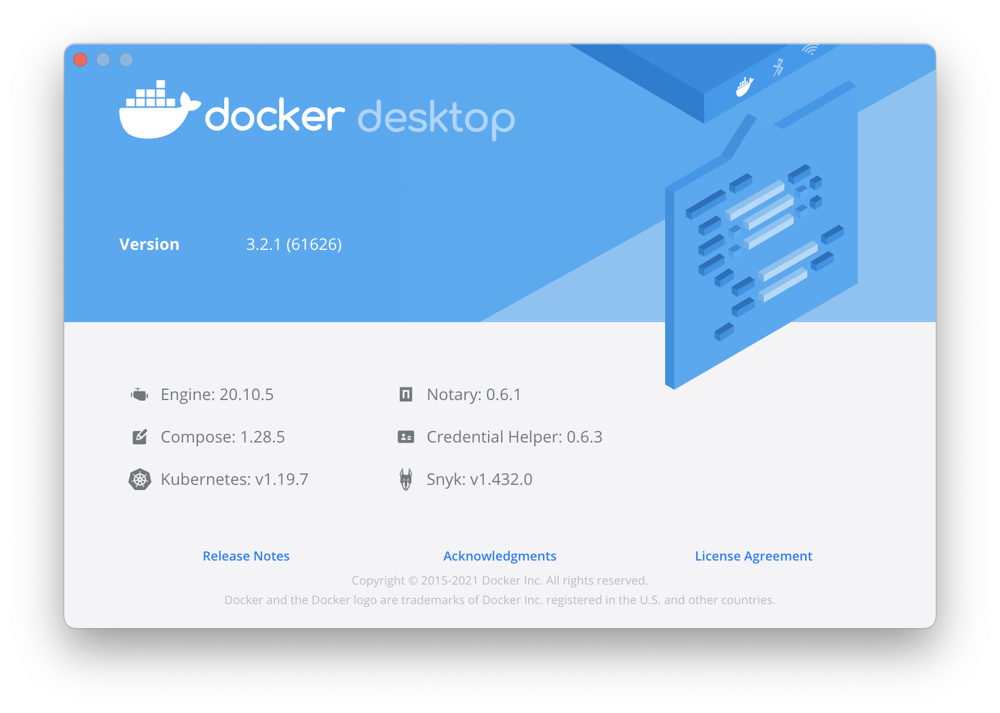

# Docker Desktop for Mac/Windows 开启 Kubernetes




##### Kubernetes v1.19.7

```
docker/desktop-kuberneteskubernetes-v1.19.7-cni-v0.8.5-critools-v1.17.0-debian
docker/desktop-storage-provisionerv1.1
docker/desktop-vpnkit-controllerv1.0
k8s.gcr.io/coredns1.7.0
k8s.gcr.io/etcd3.4.13-0
k8s.gcr.io/kube-apiserverv1.19.7
k8s.gcr.io/kube-controller-managerv1.19.7
k8s.gcr.io/kube-proxyv1.19.7
k8s.gcr.io/kube-schedulerv1.19.7
k8s.gcr.io/pause3.2
quay.io/kubernetes-ingress-controller/nginx-ingress-controller0.26.1
```
